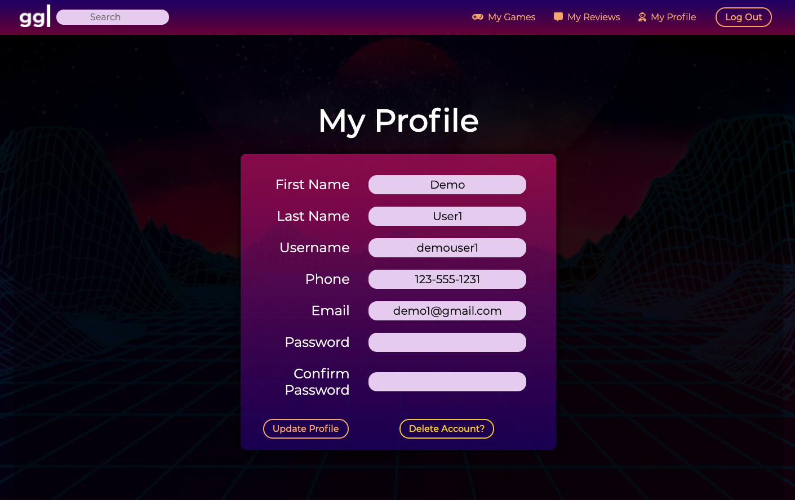

## Welcome to the GoodGames Repo!
***GoodGames*** is a clone of GoodReads that focuses on surfacing the most popular video games to play. Users contribute to the community by adding reviews for games they've played. Games with the most user feedback are ranked against their peers, with the top 20 games from each category displayed for all to see and enjoy. Developers can leverage feedback from the site to improve their games, patch bugs, and promote new soon to be released titles.

#### Technologies: Express, Node, Sequelize, Pug, CSS3 

&nbsp;&nbsp;&nbsp;&nbsp;&nbsp;&nbsp;&nbsp;&nbsp;&nbsp;&nbsp;

The goal of this week long full-stack GoodReads clone was to have 4 fully functional core MVP features finished, which include:  
- Games  (==Books) - display game 'cards' with summary level game info
- Game Categories (==Bookshelves) - sort games into categories with their own pages
- Reviews - be able to add a review for a game
- Played Status (==Library) - be able to 'save' a game and an associated play status

In addition to the core features above, we were able to implement the following bonus features:

- CSS/Brand: Full page width / sticky nav bar with nav content contained within page wrap (@Steve!!)
- CSS/Brand: Custom form and button styling animations (@Steve!!/@Bergan!!)
- CSS/Brand: Custom designed logo gif to animate popular 'good game' shorthand, 'gg' (@Cub!!)
- CSS/Brand: Custom main page header (@Cub!!)
- FEAT: Functional Search Bar (@Bergan!!)
- FEAT: Dynamic javascript for adding/updating/removing review comment from game page when logged in (@Drew!!)
- FEAT: Dynamic javascript for adding/updating/removing games from library when logged in (@Eric!!/@Cub!!)
- FEAT: Instant Demo Login functionality allowing others to review functionality with 1-click (@Drew!!/@Eric!!)
- FEAT: Create MyReviews page to show all games a user has left reviews for (@Drew!!/@Eric!!)

For more detailed info on the scope of the MVP features, check the MVP guide [here](https://github.com/cubOlson/GoodGames/wiki/MVP-Features-&-Page-Mockups). 

&nbsp;&nbsp;&nbsp;&nbsp;&nbsp;&nbsp;&nbsp;&nbsp;&nbsp;&nbsp;

### Main Page
When a user arrives at the site, they see a nav bar containing a logo, search bar and login links at the top of the page. Below the nav bar is a GoodGames banner, followed by a grid of game cards that display the image of the game, its rating, and the ability to adjust its 'play' status if logged in. Each game card links directly to the games info page (see below). To the right of the game card grid lives a category bar with links to sort games by popular categories.

&nbsp;&nbsp;&nbsp;&nbsp;&nbsp;&nbsp;&nbsp;&nbsp;&nbsp;&nbsp;

### Login/Signup/Splash Pages 
To gain access to the sites full features, a user can login or sign up for a new GoodGames account via the nav bar links in the top right corner of the main page. We've added a demo login button option to instantly log in and explore the sites functionality without requiring an account signup. Once logged in, the users nav bar menu options change, revealing MyGames, MyReviews and MyProfile tabs to review user-specific saved content and settings. 

&nbsp;&nbsp;&nbsp;&nbsp;&nbsp;&nbsp;&nbsp;&nbsp;&nbsp;&nbsp;

### MyGames & MyReviews
When a logged in user clicks on MyGames or MyReviews from the nav bar, they will see a new grid of game cards. The MyGames tab shows all game cards a user has interacted with (i.e. updated the play status). Similarly, the MyReview page also shows game cards, which when clicked bring the user back to the game info page where they can view, edit or delete their past reviews.

&nbsp;&nbsp;&nbsp;&nbsp;&nbsp;&nbsp;&nbsp;&nbsp;&nbsp;&nbsp;

### Game Info Page
Whenever a game card is clicked, the user is directed to the clicked game's info page. There a user can find a brief overview of the game, its publisher, release date, user reviews and a link to purchase the game. If the user is logged in, they have the ability to add reviews to the review feed below the game description, as well as edit or delete previous reviews they've left. 

&nbsp;&nbsp;&nbsp;&nbsp;&nbsp;&nbsp;&nbsp;&nbsp;&nbsp;&nbsp;

### User Account
If at any point a user wants to update their account info or delete their account entirely, they can navigate to the MyProfile tab via the nav bar. The user account page displays a list of account setting info pre-populated in a form such that if a user wants to change something, all they need to do it enter new info and click 'Update Profile' after re-entering a valid password.

&nbsp;&nbsp;&nbsp;&nbsp;&nbsp;&nbsp;&nbsp;&nbsp;&nbsp;&nbsp;

For more info about what went into to making this project, checkout the full planning documentation links outlined in the project wiki page, [here!](https://github.com/cubOlson/GoodGames/wiki)
